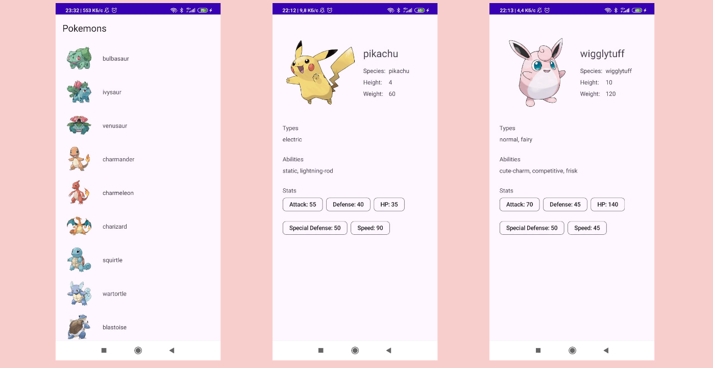

# Pokemon App

Android-приложение, в котором отображается список всех покемонов. По нажатию на элемент списка открывается экран с характеристиками выбранного покемона. 

Используемый API: [PokeAPI](https://pokeapi.co)

## Стек

* Kotlin
* Android View
* MVI
* Retrofit
* Kotlin Coroutines
  

## Интерфейс

  

  

## TODO

* Добавление пагинации списка покемонов
* Замена вызова notifyDataSetChaged на DiffUtil в адапере при получении нового списка
* Навигацию между фрагментами лучше производить через action, а не через слушателя

  
